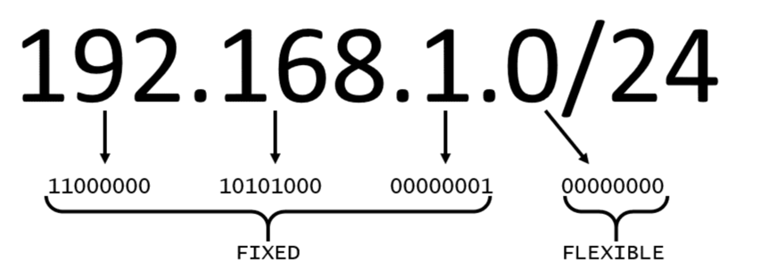
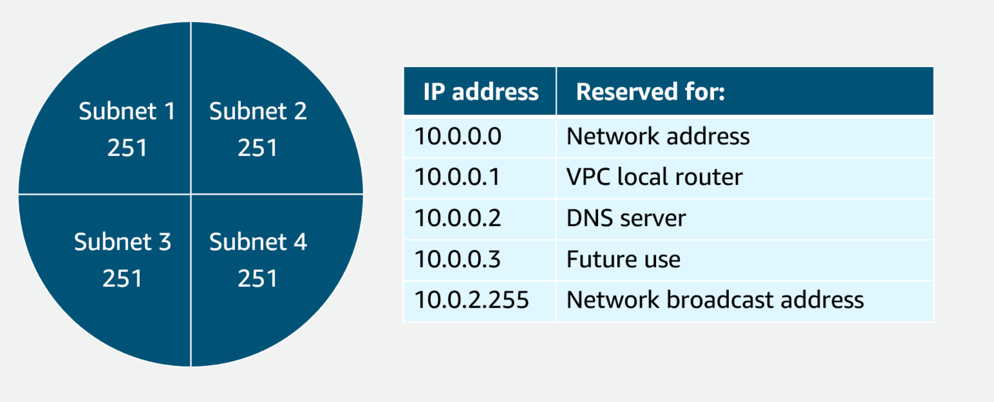
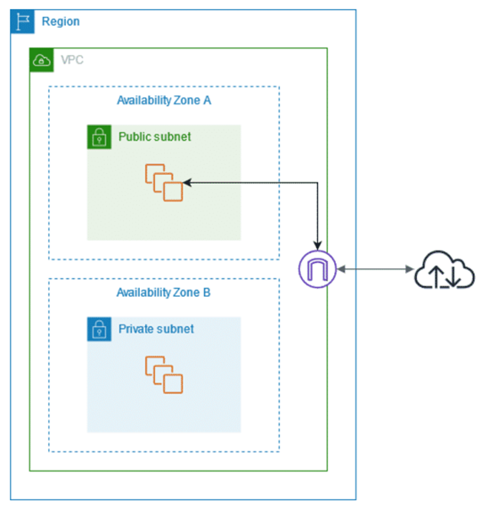
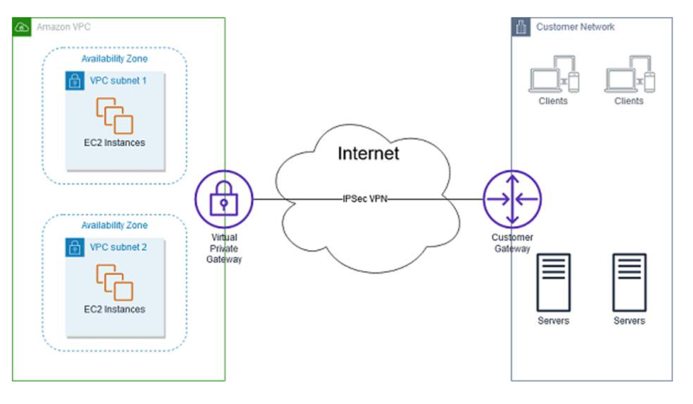
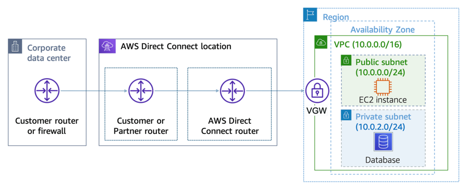
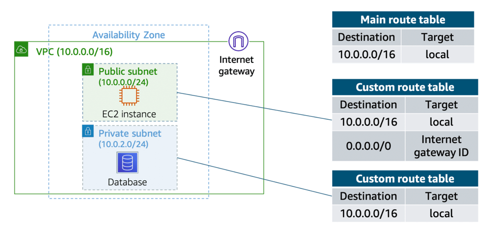
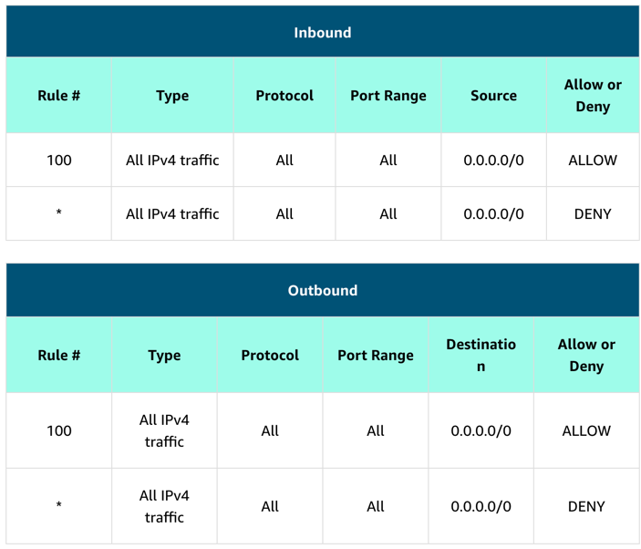

# Networking

Classless Inter-Domain Routing (CIDR) - is a compressed way of representing a range of IP addresses.
It begins with a starting IP address and is separated by a forward slash (the / character) followed by a number. The number at the end specifies how many of the bits of the IP address are fixed. In this example, the first 24 bits of the IP address are fixed. The rest (the last 8 bits) are flexible.

In AWS, the smallest IP range you can have is /28, which provides 16 IP addresses. The largest IP range you can have is a /16, which provides 65,536 IP addresses.

To maintain redundancy and fault tolerance, create at least two subnets configured in two Availability Zones.

## VPC

Virtual Private Cloud (VPC) - is an isolated network. When you create an Amazon VPC, you must choose three main factors:
- Name of the VPC
- Region where the VPC will live – A VPC spans all the Availability Zones within the selected Region.
- IP range for the VPC in CIDR notation – This determines the size of your network. Each VPC can have up to five CIDRs: one primary and four secondaries for IPv4. Each of these ranges can be between /28 (in CIDR notation) and /16 in size.

## Subnet
- smaller networks inside your base network, or virtual local area networks (VLANs) in a traditional, on-premises network.
- In an on-premises network, the typical use case for subnets is to isolate or optimize network traffic. In AWS, subnets are used to provide high availability and connectivity options for your resources. Use a public subnet for resources that must be connected to the internet and a private subnet for resources that won't be connected to the internet.

When you create a subnet, you must specify the following:
- VPC that you want your subnet to live in
- Availability Zone that you want your subnet to live in
- IPv4 CIDR block for your subnet, which must be a subset of the VPC CIDR block

Subnets can be used to segregate traffic between computers in your network.

## High availability with a VPC
To maintain redundancy and fault tolerance, create at least two subnets configured in two Availability Zones.

## Reserved IPs
For AWS to configure your VPC appropriately, AWS reserves five IP addresses in each subnet. These IP addresses are used for routing, Domain Name System (DNS), and network management.

Example with VPC with the IP range 10.0.0.0/22 (1024 total IP addresses).

## Gateway

#### Internet gateway
- To activate internet connectivity for your VPC, you must create an internet gateway.

#### Virtual private gateway
- connects your VPC to another private network. On the other side of the connection, you will need to connect a customer gateway to the other private network. A customer gateway device is a physical device or software application on your side of the connection.
- 

#### AWS Direct Connect
- To establish a secure physical connection between your on-premises data center and your Amazon VPC. Internal network is linked to an AWS Direct Connect location over a standard Ethernet fiber-optic cable. This connection allows you to create virtual interfaces directly to public AWS services or to your VPC.
- 

## VPC Routing
- A route table contains a set of rules, called routes, that determine where network traffic from your subnet or gateway is directed.

#### Main route table
- A route table contains a set of rules, called routes, that are used to determine where network traffic is directed. The default configuration of the main route table is to allow traffic between all subnets in the local network. The following rules apply to the main route table:

- You cannot delete the main route table.
- You cannot set a gateway route table as the main route table.
- You can replace the main route table with a custom subnet route table.
- You can add, remove, and modify routes in the main route table.
- You can explicitly associate a subnet with the main route table, even if it's already implicitly associated.

#### Custom Route Tables
If you associate a subnet with a custom route table, the subnet will use it instead of the main route table. You can protect your VPC by explicitly associating each new subnet with a custom route table and leaving the main route table in its original default state.

## Amazon VPC Security
Network Access Control List (NACL) - virtual firewall at the subnet level. It lets you control what kind of traffic is allowed to enter or leave your subnet.

#### Default NACL

Network ACLs are considered stateless, so you need to include both the inbound and outbound ports used for the protocol (If you don’t include the outbound range, your server would respond but the traffic would never leave the subnet.).

#### Security groups
The default configuration of a security group blocks all inbound traffic and allows all outbound traffic.
Security groups are stateful.

A common design pattern is to organize resources into different groups and create security groups for each to control network communication between them.