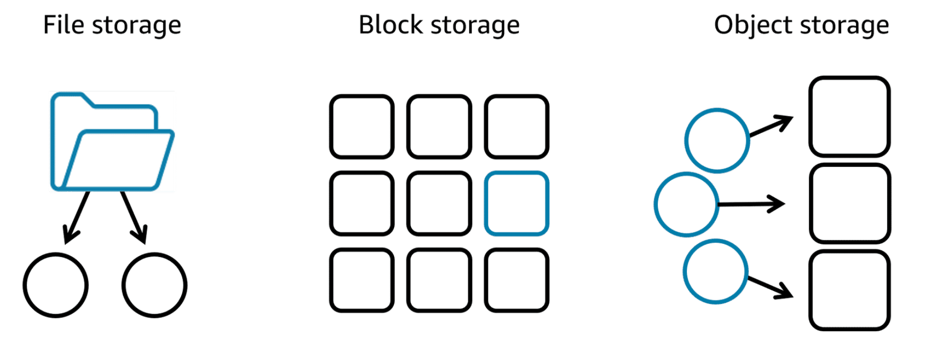
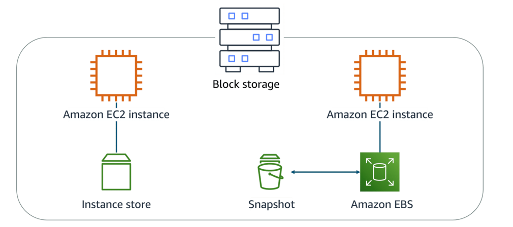

# AWS Storage Services

AWS storage services are grouped into three categories:
- file storage (data is stored as files in a hierarchy)
- block storage (data is stored in fixed-size blocks)
- object storage (data is stored as objects in buckets)

## File storage
Files are organized in a tree-like hierarchy that consist of folders and subfolders.
Each file has metadata such as file name, file size, and the date the file was created and path.

File storage is ideal when you require centralized access to files that must be easily shared and managed by multiple host computers. Typically, this storage is mounted onto multiple hosts, and requires file locking and integration with existing file system communication protocols.

File storage systems are often supported with a network-attached storage (NAS) server.

### Use cases for file storage:
- Web serving
- Analytics
- Media and entertainment
- Home directories

## Block storage
Block storage splits files into fixed-size chunks of data called blocks that have their own addresses.
Each block is an individual piece of data storage.
Because each block is addressable, blocks can be retrieved efficiently.

Block storage in the cloud is analogous to direct-attached storage (DAS) or a storage area network (SAN).

### Use cases for block storage
Block storage is optimized for low-latency operations, it is a preferred storage choice for high-performance enterprise workloads and transactional, mission-critical, and I/O-intensive applications.
- Transactional workloads
- Containers
- Virtual machines

## Object storage
Objects, much like files, are treated as a single, distinct unit of data when stored.
Objects are stored in a bucket using a flat structure.
Each object contains a unique identifier. This identifier, along with any additional metadata, is bundled with the data and stored.

### Use cases for object storage
Store almost any type of data, and there is no limit to the number of objects stored, which makes it readily scalable.
Object storage is generally useful when storing large or unstructured data sets.
- Data archiving
- Backup and recovery
- Rich media

___

# Amazon Elastic File System (Amazon EFS)
set-and-forget file system that automatically grows and shrinks as you add and remove files.
EFS can be used with AWS compute services and on-premises resources.
You pay only for the storage used and you can choose from a range of storage classes designed to fit your use case. 

### Standard storage classes
- EFS Standard and EFS Standard-Infrequent Access (Standard-IA) offer Multi-AZ resilience and the highest levels of durability and availability.

### One zone storage classes
- EFS One Zone and EFS One Zone-Infrequent Access (EFS One Zone-IA) provide additional savings by saving your data in a single availability zone.

# Amazon FSx
 fully managed service that offers reliability, security, scalability, and a broad set of capabilities that make it convenient and cost effective to launch, run, and scale high-performance file systems in the cloud.
 With Amazon FSx, you can choose between four widely used file systems: 
 - Lustre (designed for applications that require fast storage, where you want your storage to keep up with your compute.). FSx for Lustre delivers the highest levels of throughput (up to 1+ TB/s) and IOPS (millions).
 - NetApp ONTAP (can serve as a drop-in replacement for existing ONTAP deployments, giving customers the ability to launch and run ONTAP file systems in the cloud.  )
 - OpenZFS (delivers leading performance for latency-sensitive and small-file workloads with popular NAS data management capabilities (snapshots, and cloning), at a lower price than commercially licensed alternatives.)
 - Windows File Server (emoves the administrative tasks of setting up and provisioning file servers and storage volumes and provides ease of use for customers building and running Windows applications.)
___

# Block Storage with Amazon EC2 Instance Store and Amazon EBS

### Amazon EC2 instance store
provides temporary block-level storage for an instance. Instance store is ideal if you host applications that replicate data to other EC2 instances, such as Hadoop clusters.

### Amazon EBS
is block-level storage that you can attach to an Amazon EC2 instance.

- Detachable
- Distinct
- Size-limited
- 1-to-1 connection

#### Scaling Amazon EBS volumes

1) Increase volume size (maximum volume size of 64 tebibytes (TiB))
2) Attach multiple volumes

#### Amazon EBS use cases:
- store an operating system (EBS-backed AMIs)
- databases 
- enterprise / business-critical applications
- big data analytics engines

#### EBS volume types
- solid-state drives (SSDs) - transactional workloads with frequent read/write operations with small I/O size.
- hard-disk drives (HDDs) - large streaming workloads that need high throughput performance.

#### Amazon EBS benefits
- High availability (replicated in its AZ)
- Data persistence
- Data encryption (must be actived by the user)
- Flexibility (support on-the-fly changes of volume type, size, IOPS)
- Backups

#### Amazon EBS snapshots
EBS snapshots are incremental backups that only save the blocks on the volume that have changed after your most recent snapshot.
The backups are stored redundantly in multiple Availability Zones using Amazon S3.
EBS snapshots can be used to create multiple new volumes, whether they’re in the same Availability Zone or a different one.
___

# Amazon S3
Amazon S3 is an object storage service. Object storage stores data in a flat structure. An object is a file combined with metadata.

A partition is a grouping of Regions, of which AWS currently has three: Standard Regions, China Regions, and AWS GovCloud (US)

Amazon S3 reinforces encryption in transit (as it travels to and from Amazon S3) and at rest. To protect data, Amazon S3 automatically encrypts all objects on upload and applies server-side encryption with S3-managed keys as the base level of encryption for every bucket in Amazon S3 at no additional cost.

#### Amazon S3 storage classes
- S3 Standard
- S3 Intelligent-Tiering
- S3 Standard-Infrequent Access (S3 Standard-IA)
- S3 One Zone-Infrequent Access (S3 One Zone-IA)
- S3 Glacier Instant Retrieval
- S3 Glacier Flexible Retrieval
- S3 Glacier Deep Archive
- S3 on Outposts

#### S3 versioning states
- unversioned (default)
- versioning-enabled
- versioning-suspended

#### Amazon S3 use cases
- backup and storage
- media hosting
- software delivery
- data lakes
- static websites
- static content