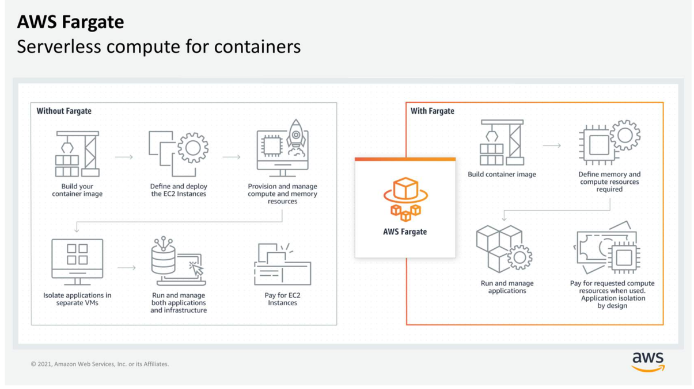

# ECS EKS Fargate Lambda

No one-size-fits-all compute service exists because it depends on your needs. The key is to understand what each option offers.

## Containers

UNIX kernels - the central core of the operating system
A container is a standardized unit that packages your code and its dependencies.

### Difference between VMs and Containers

Compared to virtual machines (VMs), containers share the same operating system and kernel as the host that they are deployed on.
Containers share the same operating system and kernel as the host that they exist on. But virtual machines contain their own operating system.
Containers can provide speed, but virtual machines offer the full strength of an operating system and more resources, like package installation, dedicated kernel, and more.

### AWS container orchestration services:
- Amazon Elastic Container Service (Amazon ECS) - is an end-to-end container orchestration service that helps you spin up new containers.

EC2 instance with the container agent installed is often called a container instance (to have more control by running and managing your containers on a cluster of Amazon EC2 instances).
Container agent is open source and responsible for communicating to the Amazon ECS service about cluster management details.

When the Amazon ECS container instances are up and running, you can perform:
- Launching and stopping containers
- Getting cluster state
- Scaling in and out
- Scheduling the placement of containers across your cluster
- Assigning permissions
- Meeting availability requirements

The task definition is a text file, in JSON format, that describes one or more containers. A task definition is similar to a blueprint that describes the resources that you need to run a container, such as CPU, memory, ports, images, storage, and networking information.

- Amazon Elastic Kubernetes Service (Amazon EKS) - is a managed service that you can use to run Kubernetes on AWS without needing to install, operate, and maintain your own Kubernetes control plane or nodes.
Kubernetes is a portable, extensible, open-source platform for managing containerized workloads and services.

Difference between EKS and ECS:
- In Amazon ECS, the machine that runs the containers is an EC2 instance that has an ECS agent installed and configured to run and manage your containers. This instance is called a container instance. In Amazon EKS, the machine that runs the containers is called a worker node or Kubernetes node. 
- An ECS container is called a task. An EKS container is called a pod.
- Amazon ECS runs on AWS native technology. Amazon EKS runs on Kubernetes.

## Serverless:
- There are no servers to provision or manage.
- It scales with usage.
- You never pay for idle resources.
- Availability and fault tolerance are built in.

### AWS Fargate
- AWS Fargate is a purpose-built serverless compute engine for containers.
- scales and manages the infrastructure
- supports both Amazon ECS and Amazon EKS architecture and provides workload isolation and improved security by design.
- abstracts the EC2 instance so that you’re not required to manage the underlying compute infrastructure.
- you can use all the same Amazon ECS concepts, APIs, and AWS integrations.

### AWS Lambda
- runs your code on a high availability compute infrastructure and requires no administration from the user.

Concepts:

1) Function. A function is a resource that you can invoke to run your code in Lambda. Lambda runs instances of your function to process events. When you create the Lambda function, it can be authored in several ways:
- create the function from scratch.
- use a blueprint that AWS provides.
- select a container image to deploy for your function.
- browse the AWS Serverless Application Repository.
2) Trigger. Triggers describe when a Lambda function should run. A trigger integrates your Lambda function with other AWS services and event source mappings. So you can run your Lambda function in response to certain API calls or by reading items from a stream or queue.
3) Event. An event is a JSON-formatted document that contains data for a Lambda function to process. The runtime converts the event to an object and passes it to your function code. When you invoke a function, you determine the structure and contents of the event.
4) Application Environment. An application environment provides a secure and isolated runtime environment for your Lambda function. An application environment manages the processes and resources that are required to run the function. 
5) Deployment package. Lambda supports two types of deployment packages: zip archive (function code and dependencies, Lambda provides the operating system and runtime for your function.) and a container image (code and dependencies in container image, you must also include the operating system and a Lambda runtime).
6) Runtime. The runtime provides a language-specific environment that runs in an application environment. When you create your Lambda function, you specify the runtime that you want your code to run in. You can use built-in runtimes, such as Python, Node.js, Ruby, Go, Java, or .NET Core. Or you can implement your Lambda functions to run on a custom runtime.
7) Lambda function handler - is the method in your function code that processes events. When your function is invoked, Lambda runs the handler method. When the handler exits or returns a response, it becomes available to handle another event. 

### AWS Lambda pricing:
You are charged for the number of times that your code is invoked (requests) and for the time that your code runs, rounded up to the nearest 1 millisecond (ms) of duration.
